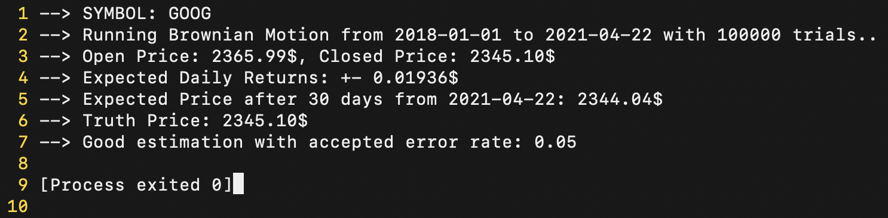
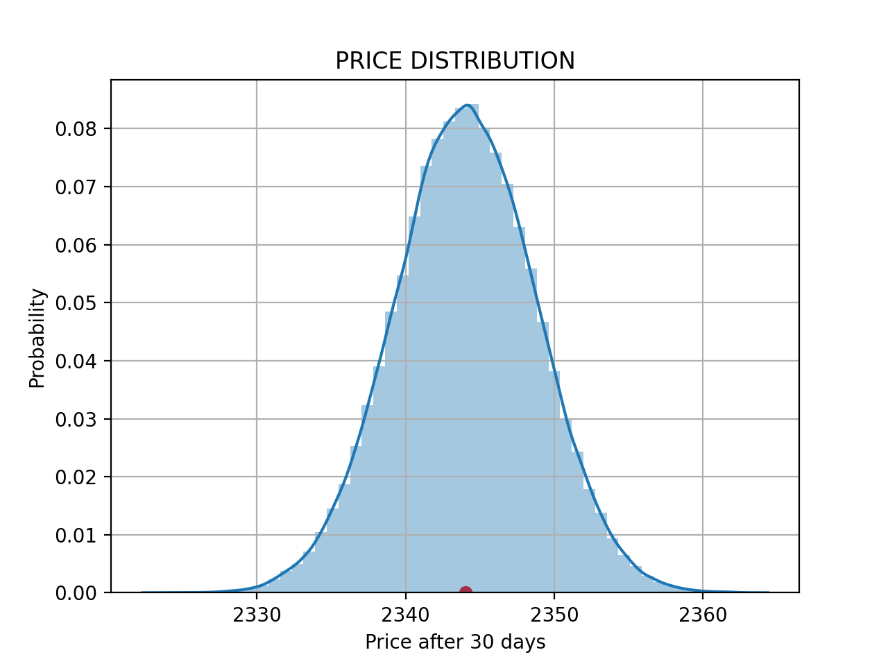

# BROWNIAN-MOTION-STOCKS
Implementation for Brownian Motion with Monte Carlo method to learn expected price for an input stock and timeframe.

## Examples
An example of using _GOOG_ ticker

## Resources
- Wikipedia: [Click Here](https://en.wikipedia.org/wiki/Geometric_Brownian_motion)
